# Task-3

Statement: We have to create a web portal for our
company with all the security as much as possible.
So, we use Wordpress software with dedicated
database server.
Database should not be accessible from the outside
world for security purposes.
We only need to public the WordPress to clients.
So here are the steps for proper understanding!

Steps:
1) Write a Infrastructure as code using terraform,
which automatically create a VPC.

2) In that VPC we have to create 2 subnets:
    a)  public  subnet [ Accessible for Public World! ] 
    b)  private subnet [ Restricted for Public World! ]

3) Create a public facing internet gateway for connect our
VPC/Network to the internet world and attach this gateway 
to our VPC.

4) Create  a routing table for Internet gateway so that 
instance can connect to outside world, update and associate
it with public subnet.

5) Launch an ec2 instance which has Wordpress setup already 
having the security group allowing  port 80 so that our client
can connect to our wordpress site.
Also attach the key to instance for further login into it.

6) Launch an ec2 instance which has MYSQL setup already with 
security group allowing  port 3306 in private subnet so that 
our wordpress vm can connect with the same.
Also attach the key with the same.

Note: Wordpress instance has to be part of public subnet so that
our client can connect our site. mysql instance has to be part 
of private  subnet so that outside world can't connect to it.
Don't forgot to add auto ip assign and auto dns name assignment 
option to be enabled.

# VPC
Amazon Virtual Private Cloud (Amazon VPC) enables you
to launch AWS resources into a virtual network that
you've defined. This virtual network closely resembles
a traditional network that you'd operate in your own
data center, with the benefits of using the scalable
infrastructure of AWS.

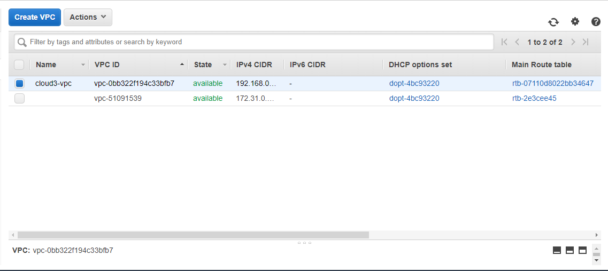

# Subnet
A subnet, or subnetwork, is a segmented piece of a larger
network. More specifically, subnets are a logical partition
of an IP network into multiple, smaller network segments. 
The Internet Protocol (IP) is the method for sending data
from one computer to another over the internet

# Gateway
A gateway is a node (router) in a computer network,
a key stopping point for data on its way to or from
other networks. Thanks to gateways, we are able to
communicate and send data back and forth. The
Internet wouldn't be any use to us without gateways.

# Let's Go

Before creating any Resources, we have to configure 
our AWS Profile:
Here we have already configure it 

    AWS Access Key ID [****************LELI]:
    AWS Secret Access Key [****************Av0P]:
    Default region name [ap-south-1]:
    Default output format [json]:
    
Then in our terraform code specifying the 
provider for creating the resources into 
the specifide provider...

    provider "aws" {
    region     = "ap-south-1"
    profile    = "Yashu"
  }
   
# Step 1:
  Firstly, we have to create a Virtual Private Network or
  VPC so that we can launch our resurces into it....
  
  Terraform code for our VPC....
  
    resource "aws_vpc" "cloud3-vpc" {
    cidr_block       = "192.168.0.0/16"
    instance_tenancy = "default"

    tags = {
      Name = "cloud3-vpc"
      }
    }

  

# Step 2:
Here in this step we are creating two subnets 
one of them is public and the other is private.
Private Subnet will store our private resources
and data which is not accessible to outside world.
Public subnet will contain the resources which
will we accessible to outside world for their use.

Public Subnet...

    resource "aws_subnet" "public-subnet2" {
    vpc_id     = aws_vpc.cloud3-vpc.id
    cidr_block = "192.168.0.0/24"
    map_public_ip_on_launch  = true
    availability_zone = "ap-south-1a"

    tags = {
      Name = "public-subnet2"
      }
    }

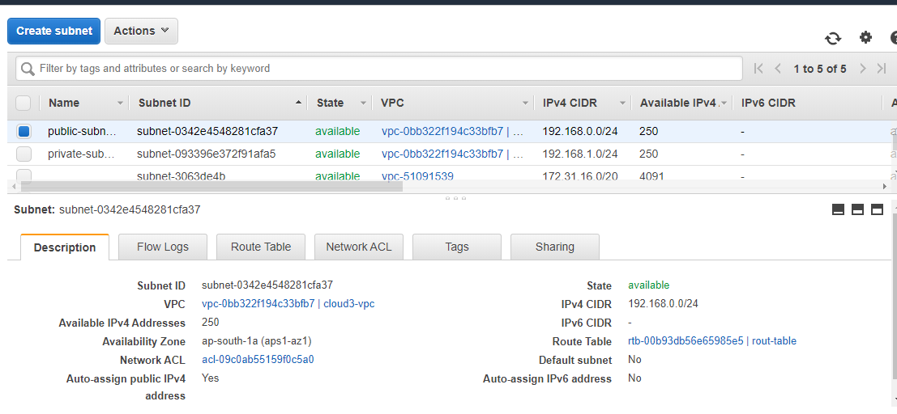

Private Subnet....

     resource "aws_subnet" "private-subnet1" {
     vpc_id     = aws_vpc.cloud3-vpc.id
     cidr_block = "192.168.1.0/24"
     availability_zone = "ap-south-1a"
     
     tags = {
       Name = "private-subnet1"
     }
   }

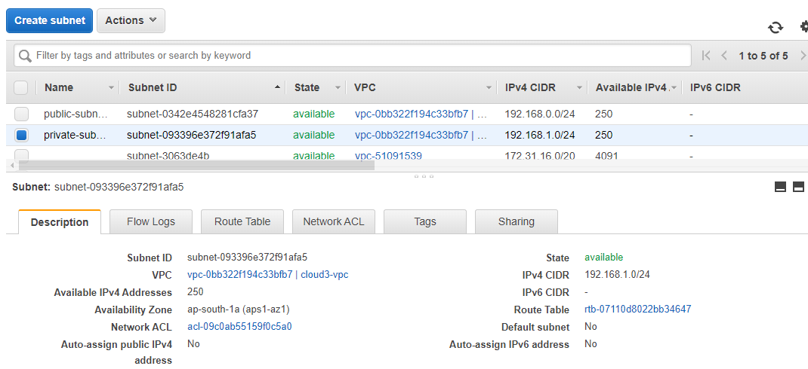

# Step 3:

Creating a public facing internet gateway to connect
our Network to the internet world and also we have to
attach this gateway to our VPC.

     resource "aws_internet_gateway" "cloud3-gateway" {
     vpc_id = aws_vpc.cloud3-vpc.id

    tags = {
      Name = "cloud3-gateway"
      }
    }     

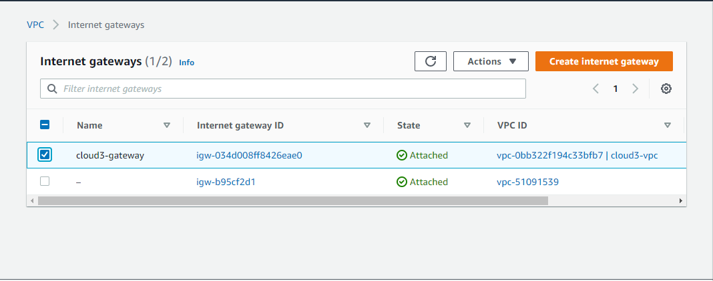

# Step 4:
Creating   a routing table for Internet gateway so that
instance can connect to outside world. 

     resource "aws_route_table" "rout-table" {
    vpc_id = aws_vpc.cloud3-vpc.id

    route {
      cidr_block = "0.0.0.0/0"
      gateway_id = aws_internet_gateway.cloud3-gateway.id
    }

    tags = {
       Name = "rout-table"
      }
    }

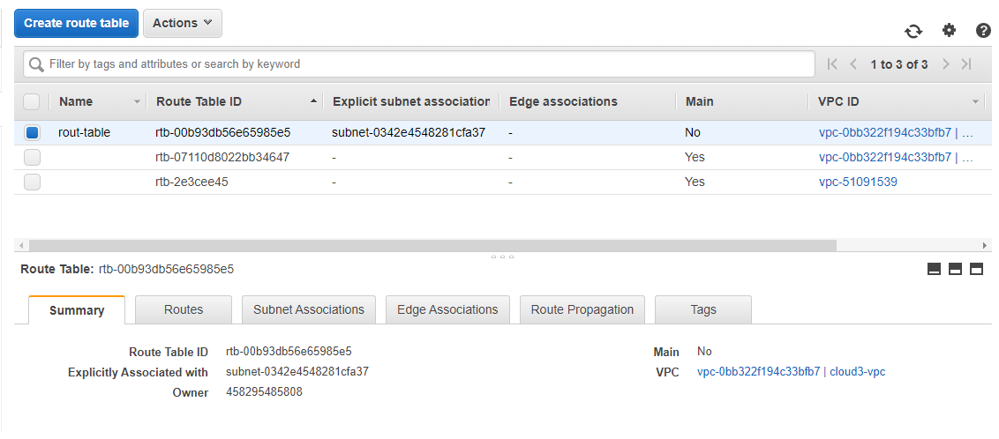

 
Associating this routing table  with our public subnet 
for availability or accessibility to outside world.

     resource "aws_route_table_association" "r-tabl-associate" {
   
      subnet_id      = aws_subnet.public-subnet2.id
      route_table_id = aws_route_table.rout-table.id
     }

# Step 5:
We have to asociate our instances to security groups 
so before launching the instances we are creatig the
security groups.

One of the Security group will be public which will
have the connectivity to the outside world.....

     resource "aws_security_group" "sgcloudpublicwp" {
     name        = "sgcloudpublicwp"
     description = "Allow HTTP, SSH and ICMP"
     vpc_id      = aws_vpc.cloud3-vpc.id
     ingress {
       description = "http"
       from_port   = 80
       to_port     = 80
       protocol    = "tcp"
       cidr_blocks = ["0.0.0.0/0"]
     }
     ingress {
       description = "ssh"
       from_port   = 22
       to_port     = 22
       protocol    = "tcp"
       cidr_blocks = ["0.0.0.0/0"]
     }
     ingress {
       description = "icmp"
       from_port   = 0
       to_port     = 0
       protocol    = "tcp"
       cidr_blocks = ["0.0.0.0/0"]
     }
     ingress {
       description = "mysql"
       from_port   = 3306
       to_port     = 3306
       protocol    = "tcp"
       cidr_blocks = ["0.0.0.0/0"]
     }

     egress {
       from_port   = 0
       to_port     = 0
       protocol    = "-1"
       cidr_blocks = ["0.0.0.0/0"]
     }

     tags = {
       Name = "sgcloudpublicwp"
       }
     }
  
  
  
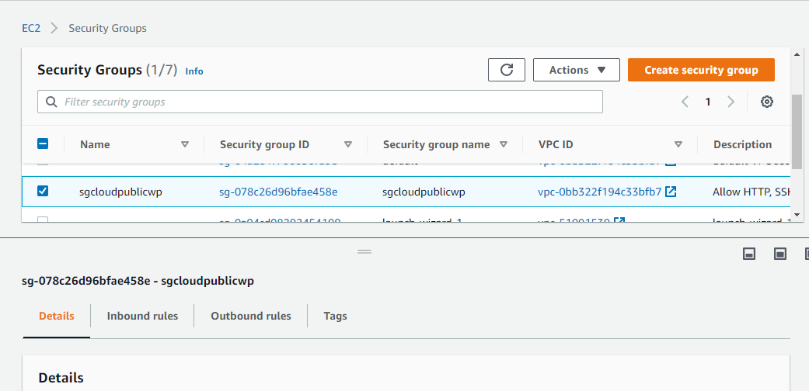

Now launching our Public instance...

Wordpress instance which will have connectivity to 
the outside world...

    resource "aws_instance" "instance-a-wordpress" {
     ami           = "ami-ff82f990"
     instance_type = "t2.micro"
     associate_public_ip_address = true
     subnet_id = aws_subnet.public-subnet2.id
     vpc_security_group_ids = [aws_security_group.sgcloudpublicwp.id]
     key_name = "cloudkey3"

      tags = {
       Name = "wordpress-os"
       }
     } 

# Step 6:
Other Security Group will we private to launch
our private instance which only have connectivity 
to our public instance...

     resource "aws_security_group" "sgroupprivate" {
     name        = "sgroupprivate"
     description = "Allow inbound traffic"
     vpc_id      = aws_vpc.cloud3-vpc.id

     ingress {
       description = "mysql"
       from_port   = 3306
       to_port     = 3306
       protocol    = "tcp"
       security_groups = [aws_security_group.sgcloudpublicwp.id]
     }

     ingress {
       description = "PING"
       from_port   = -1
       to_port     = -1
       protocol    = "icmp"
       security_groups = [aws_security_group.sgcloudpublicwp.id]
     }

     tags = {
       Name = "sgroupprivate"
     }
    }

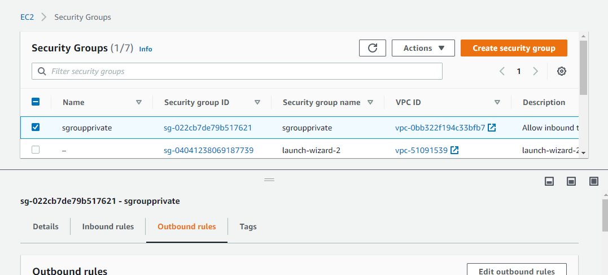

Our Private MySql server which will store our
private data...
   
      resource "aws_instance" "mysql-private" {
      ami           = "ami-08706cb5f68222d09"
      instance_type = "t2.micro"
      vpc_security_group_ids = [aws_security_group.sgroupprivate.id]
      key_name = "cloudkey3"
      subnet_id = aws_subnet.private-subnet1.id
  
      tags = {
        Name = "mysql-private"
       }
     }

Instances that we have launched...

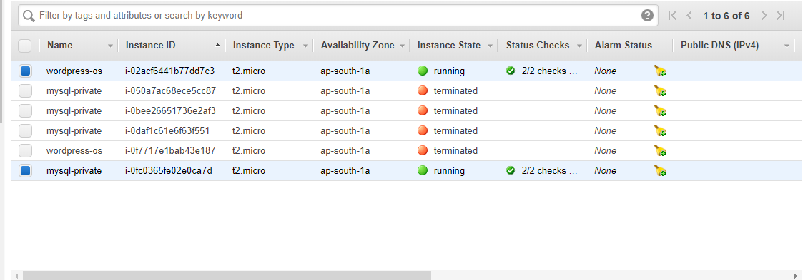

We can check if our code is properly working or not
with command...
       
        terraform validate
        
After we have done with our terraform code, launching
the resources using command...

     terrform apply --auto-approve
     
     
 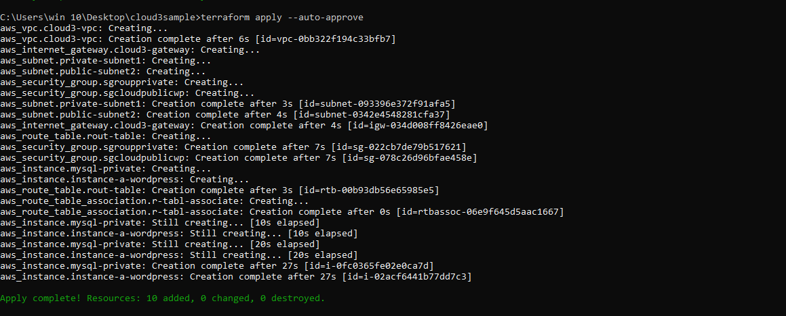    

Now all our resources are launched, we can go to 
our AWS webUI to check all the resources..

For login into our wordpress server we can use..

     ssh -i /path/my-key-pair.pem my-instance-user-name@my-instance-IPv6-address 
     
This is our Wordpress site....

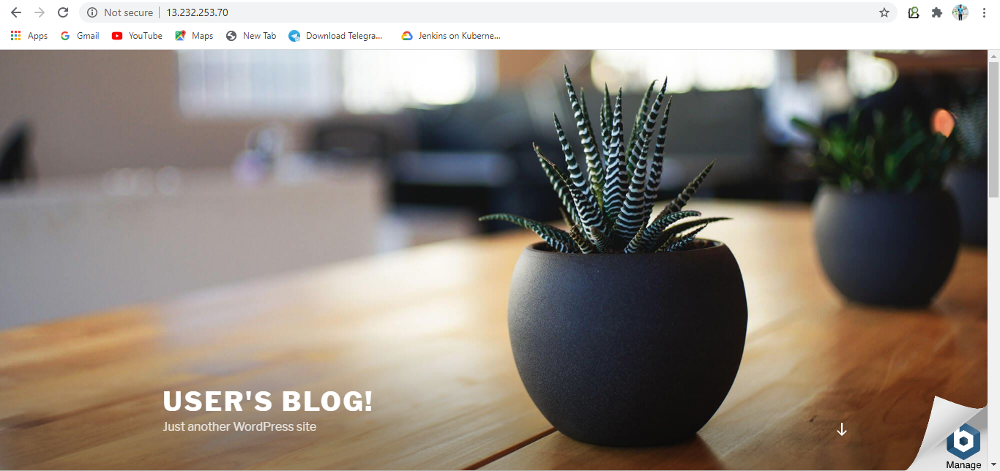
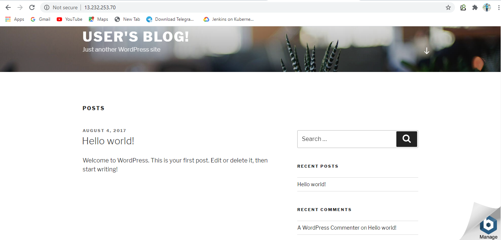

After we have completed with our work we can destroy
all our resources with command....
  
      terraform destroy --auto-approve
 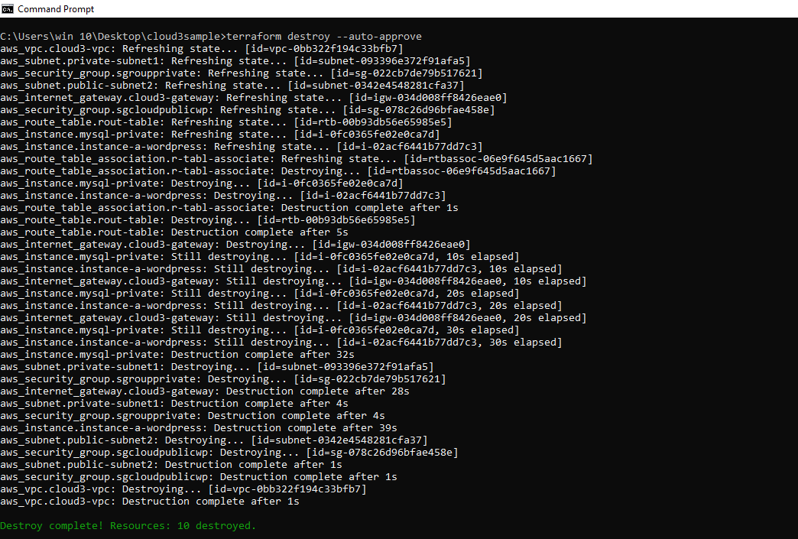     

Thank You for having a look at my Work....
